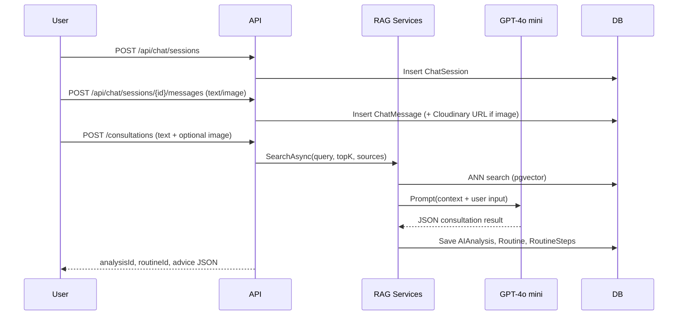

# Consultation & Routine Flows

This document summarises how the current SkinCareSystem backend delivers AI-driven consultations and skincare routines. It covers the two key flows (user consultation from text & image, and routine generation), shows the RAG pipeline, and gives sample payloads.

---

## 1. Chat → Consultation Flow (Text & Image)

1. **Create chat session**  
   `POST /api/chat/sessions` with `ChatSessionCreateDto` (optionally `title`).  
   ↳ Returns `sessionId`.

2. **Store user messages**  
   - Text: `POST /api/chat/sessions/{sessionId}/messages` (`ChatMessageCreateDto`).  
   - Image: `POST /api/chat/sessions/{sessionId}/messages/upload` (multipart form).  
     Server uploads to Cloudinary (fallback → local) and persists URL in `ChatMessages.image_url`.

3. **Request consultation**  
   `POST /consultations` (multipart form) with:
   ```json
   {
     "text": "Da dầu, mụn ẩn vùng má, nhạy cảm.",
     "image": (optional file),
     "imageUrl": (optional existing URL)
   }
   ```

4. **RAG Retrieval**  
   `ConsultationService` calls `IRagSearchService.SearchAsync()` →  
   - OpenAI embeddings (1536 dim).  
   - pgvector ANN (HNSW, cosine).  
   - Fetches `DocumentChunks` + top 3 `MedicalDocumentAssets` per document.

5. **LLM Synthesis**  
   GPT-4o mini with constrained JSON schema (summary, confidence, recommendations with mandatory `disclaimer`, routine steps). Context trimmed to ~3.5k chars including image URLs.

6. **Persistence**  
   Within one transaction:
   - `ChatSessions` / `ChatMessages` (user prompt).  
   - `AIAnalysis` (raw input + result JSON).  
   - `Routines` & `RoutineSteps` (FK → `AIAnalysis`).  

7. **Response**  
   ```json
   {
     "analysisId": "guid",
     "routineId": "guid",
     "confidence": 0.84,
     "advice": { ... LLM JSON ... },
     "context": [
       { "chunkId": "...", "docId": "...", "title": "...", "assetUrls": ["..."] }
     ]
   }
   ```

### Mermaid Sequence



---

## 2. Routine Retrieval Flow

After a consultation, routines can be queried or managed via existing endpoints:

- `GET /api/routines/user/{userId}` – list routines.  
- `GET /api/routines/{routineId}` – routine details + steps.  
- `GET /api/routinesteps/routine/{routineId}` – individual steps.  

All responses use DTOs via AutoMapper. Status defaults to `active`; updates allowed via routine services if needed.

---

## 3. RAG Pipeline Summary

1. **Embedding**: `IRagSearchService` uses OpenAI `text-embedding-3-small` (1536 dims).  
2. **ANN Search**: `DocumentChunks.embedding` (pgvector) + HNSW cosine index.  
3. **Context Assembly**: Top-K chunk text + Cloudinary image URLs (from `MedicalDocumentAssets`).  
4. **LLM Prompt**: GPT-4o mini (JSON schema ensures disclaimer + routine steps).  
5. **Persistence**: `AIAnalysis`, `Routines`, `RoutineSteps`.  
6. **Response**: Returns IDs, confidence, advice JSON, and evidence context for auditing/UI rendering.

---

## 4. Consent Handling

Consent endpoints (`/api/ConsentRecords`) remain available but are optional. If you skip collecting user consent, the consultation & routine flows continue to function because no hard FK or logic depends on consent rows.

---

## 5. Endpoints Involved (Checklist)

| Flow | Endpoint | Notes |
|------|----------|-------|
| Start chat | `POST /api/chat/sessions` | returns sessionId |
| Text message | `POST /api/chat/sessions/{sessionId}/messages` | persists text |
| Image message | `POST /api/chat/sessions/{sessionId}/messages/upload` | uploads to Cloudinary |
| Run consultation | `POST /consultations` | orchestrates RAG + LLM |
| Search context | `POST /rag/search` | debug / UI preview of retrieved knowledge |
| Fetch routine | `GET /api/routines/{id}` | returns routine DTO |

All above controllers inherit `BaseApiController`, wrapping `ServiceResult` into `ApiResponse<T>`.

---

## 6. Sample Consultation Request/Response

**Request**
```
POST /consultations
Content-Type: multipart/form-data

text = "Da dầu, mụn ẩn vùng má, nhạy cảm."
image = (binary jpg)
```

**Response**
```json
{
  "status": 200,
  "success": true,
  "message": "Tư vấn đã được tạo.",
  "data": {
    "analysisId": "b28ce8d5-8d0d-4e9b-8d88-f2da3f1b83a0",
    "routineId": "7dbf230a-0b42-4da8-b09a-3907e9ef4753",
    "confidence": 0.82,
    "advice": {
      "summary": "Tóm tắt tình trạng...",
      "recommendations": [
        { "type": "routine", "title": "...", "details": "..." },
        { "type": "disclaimer", "title": "Khuyến cáo y khoa", "details": "..." }
      ],
      "routine": {
        "description": "Routine cá nhân hóa",
        "steps": [
          { "order": 1, "instruction": "...", "time_of_day": "morning", "frequency": "daily" }
        ]
      }
    },
    "context": [
      {
        "chunkId": "a1...",
        "docId": "b1...",
        "title": "Hướng dẫn điều trị da dầu",
        "source": "guideline:vn-2024",
        "content": "...",
        "distance": 0.21,
        "similarity": 0.79,
        "assetUrls": [
          "https://res.cloudinary.com/.../image/upload/v123/doc.png"
        ]
      }
    ]
  },
  "timestamp": "2024-06-04T10:21:34.511Z"
}
```

---

## 7. Key Points (Answers 1→7)

1. **Chat-to-AI flow**: user opens session → logs messages → `/consultations` triggers retrieval + GPT → results persisted & returned. Works end-to-end.  
2. **Image handling**: yes. Chat and consultation uploads go to Cloudinary (fallback local), URLs stored in `ChatMessages.image_url` and passed to the RAG context.  
3. **Routine generation**: yes. Consultation persists rows in `Routines` (status `active`, FK → `AIAnalysis`) and `RoutineSteps`.  
4. **Consultation service**: orchestrates ingestion (text/image), calls RAG, prompts GPT, saves AIAnalysis/ Routine/Steps, returns JSON payload for UI.  
5. **Consent**: optional. Not collecting it does **not** break the flows.  
6. **Endpoints present**: flows covered by `ChatSessionsController`, `ChatMessagesController`, `ConsultationsController`, `RagController`, and routine endpoints. Nothing missing.  
7. **RAG usage**: OpenAI embedding → pgvector HNSW ANN → merge chunk text + image URLs → GPT JSON schema → persisted results returned to client.

---

_Last updated: 2024-06-04_
